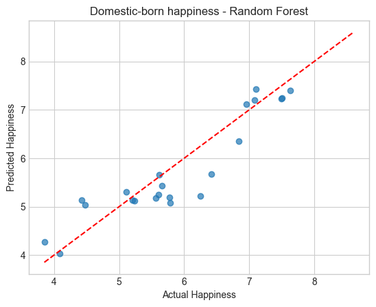
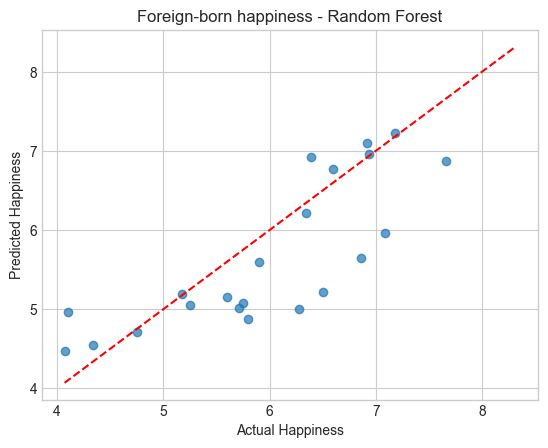

# Where Would I Thrive Abroad

---

## Project Proposal

This project will explore what factors influence expatriate success and happiness - such as GDP, health, social structures. Using real-world datasets of country economic and social metrics, this project will investigate how those metrics influence happiness in both domestic and foreign-born country residents.

"Is the happiness of foreign country residents influenced the same way as domestic residents?". To answer this, we will conduct Exploratory Data Analysis (EDA) to uncover initial patterns and correlations, followed by Hypothesis testing to determine if the influence of the like GDP differs between the domestic and foreign-born population. Finally, we will apply Machine Learning techniques to build a predictive model that calculates the degree to which those factors contribute to the happiness of the domestic and foreign-born population.

---

## Motivation

As an international student who wants to work abroad, I would like to make an informed decision by moving beyond simple job placement and economic metrics to prioritize long-term well-being and happiness.

---

## Data Sources

### 1. Happiness and Social Data (The Core Model)

| Dataset Name | Source | Data Role |
| :--- | :--- | :--- |
| **WHR Happiness Data** | WHR 2018 Statistical Appendix 2 (Table 1) | Provides the Overall Happiness Of Domestic and Foreign-born population. |

### 2. Economic, Safety, and Social Metrics

| Dataset Name | Source | Key Metrics Included | Data Role |
| :--- | :--- | :--- | :--- |
| **Economic & Health Data** | World Bank DataBank | **GDP per Capita (PPP)**, Unemployment Rate, Infant Mortality Rate. | Provides objective **economic opportunity** and **heatlh** metrics. |
| **Safety Data** | Institute for Economics & Peace (IEP) | **Global Peace Index (GPI) Score.** | Provides an independent measure of **geopolitical safety** and **risk**. |

---

## Hypothesis Testing

### Hypothesis 1

**Null Hypothesis (H₀):** There is no statistically significant correlation between GDP Per Capita and **Domestic**-born happiness.

**Alternative Hypothesis (H₁):** There is a statistically significant correlation between GDP Per Capita and **Domestic**-born happiness.

### Hypothesis 2

**Null Hypothesis (H₀):** There is no statistically significant correlation between GDP Per Capita and **Foreign**-born happiness.

**Alternative Hypothesis (H₁):** There is a statistically significant correlation between GDP Per Capita and **Foreign**-born happiness.

---

### Hypothesis 3

**Null Hypothesis (H₀):** There is no statistically significant correlation between unemployment and **Domestic**-born happiness.

**Alternative Hypothesis (H₁):** There is a statistically significant correlation between unemployment and **Domestic**-born happiness.

### Hypothesis 4

**Null Hypothesis (H₀):** There is no statistically significant correlation between Unemployment and **Foreign**-born happiness.

**Alternative Hypothesis (H₁):** There is a statistically significant correlation between Unemployment and **Foreign**-born happiness.

---

### Hypothesis 5

**Null Hypothesis (H₀):** There is no statistically significant correlation between Global Peace Index and **Domestic**-born happiness.

**Alternative Hypothesis (H₁):** There is a statistically significant correlation between Global Peace Index and **Domestic**-born happiness.

### Hypothesis 6

**Null Hypothesis (H₀):** There is no statistically significant correlation between Global Peace Index and **Foreign**-born happiness.

**Alternative Hypothesis (H₁):** There is a statistically significant correlation between Global Peace Index and **Foreign**-born happiness.

---

### Hypothesis 7

**Null Hypothesis (H₀):** There is no statistically significant correlation between Infant Mortality and **Domestic**-born happiness.

**Alternative Hypothesis (H₁):** There is a statistically significant correlation between Infant Mortality and **Domestic**-born happiness.

### Hypothesis 8

**Null Hypothesis (H₀):** There is no statistically significant correlation between Infant Mortality and **Foreign**-born happiness.

**Alternative Hypothesis (H₁):** There is a statistically significant correlation between Infant Mortality and **Foreign**-born happiness.

---

### Testing

To test those hypothesis we used spearmans coefficient and the results are as follows

+ There is a statistically significant **positive** correlation between GDP Per Capita and **Domestic-born** happiness

+ There is a statistically significant **positive** correlation between GDP Per Capita and **Foreign-born** happiness

+ There is no statistically significant correlation between Unemployment and **Domestic-born** happiness

+ There is no statistically significant correlation between Unemployment and **Foreign-born** happiness

+ There is a statistically significant **negative** correlation between Global Peace Index and **Domestic-born** happiness

+ There is a statistically significant **negative** correlation between Global Peace Index and **Foreign-born** happiness

+ There is a statistically significant **negative** correlation between Infant Mortality and **Domestic-born** happiness

+ There is a statistically significant **negative** correlation between Infant Mortality and **Domestic-born** happiness

## Machine Learning Methods

--- 

For this part we applied supervised machine learning to predict the happiness scores for the domestic-born and foreign-born populations using the country metrics.

We trained 2 seperate models for each population type (domestic-born population & foreign-born population) for comparison.

### Models Used

**1. Linear Regression**: We used linear regression as a baseline to compare with the forest regressor to see whether the linear model or non-linear model works best.

**2. Forest Regressor**: This is our main model for predicting Happiness for both population types given country metrics.

### Evaluation Metrics

To evaluate both models we will use standard regression metrics:

+ **MAE (Mean Absolute Error)**: average difference between actual and predicted values.
+ **RMSE (Root Mean Squared Error)**: root square of the average squared difference.
+ **R2**: How well the model explains the data.

### Results

**Domestic-born happiness (Linear Regression):**
+ MAE: 0.585
+ RMSE: 0.668
+ R²: 0.636

**Foreign-born happiness (Linear Regression):**
+ MAE: 0.764
+ RMSE: 0.903
+ R²: 0.185

--- 

**Domestic-born happiness (Random Forest Regression):**
+ MAE: 0.365
+ RMSE: 0.448
+ R²: 0.836

**Foreign-born happiness (Random Forest Regression):**
+ MAE: 0.524
+ RMSE: 0.677
+ R²: 0.541

### Actual vs. Predicted Graphs

### Result Interpretation

+ Random Forest Regression outperformed Linear Regression for predicting happiness in both populations, shown by lower MAE/RMSE and higher R² scores.

+ Domestic-born happiness is much more predictable from the country-level metrics than foreign-born happiness.

+ This suggests domestic-born happiness is strongly tied to the included national indicators (GDP, health, peace, etc.), while foreign-born happiness likely has more deciding factors.

